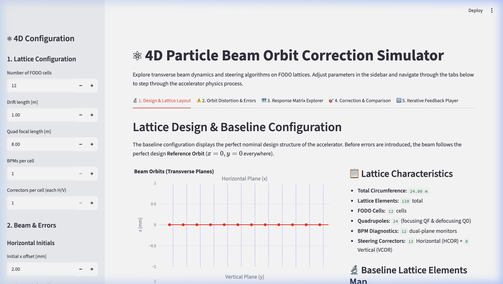
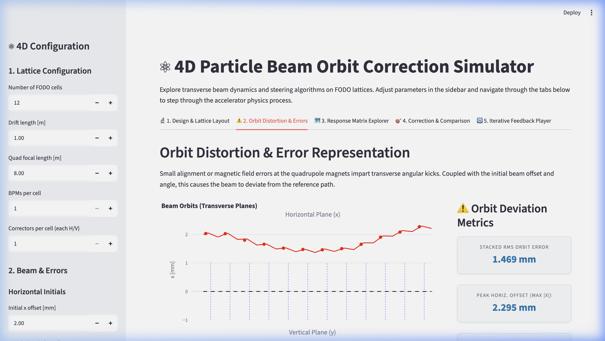
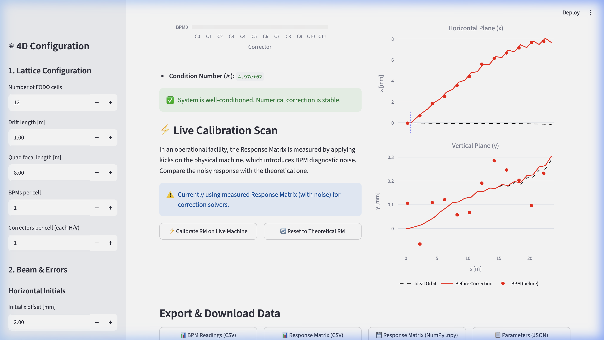
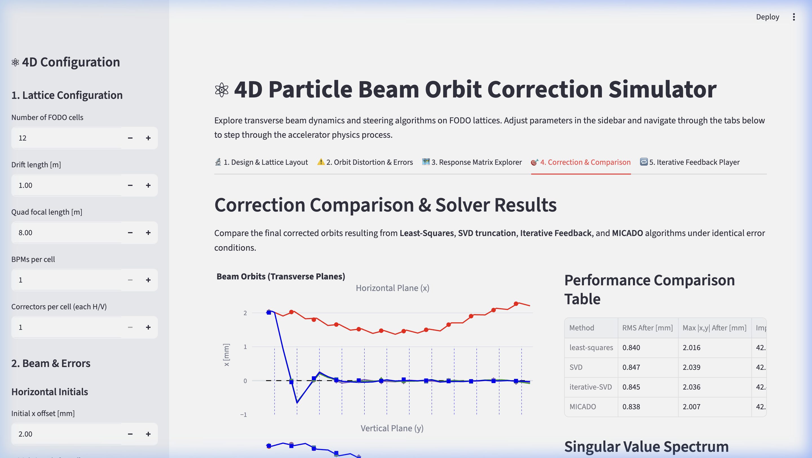
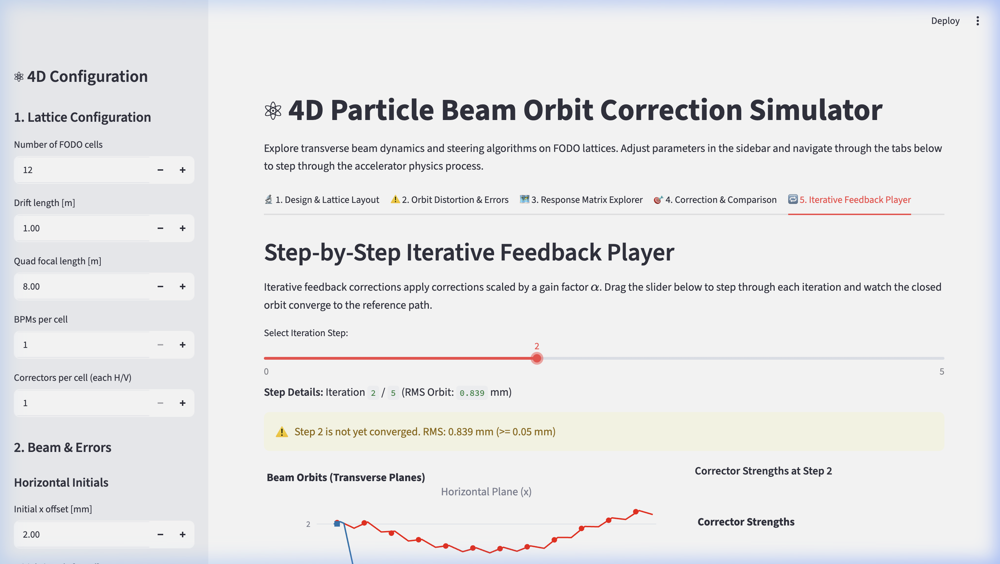
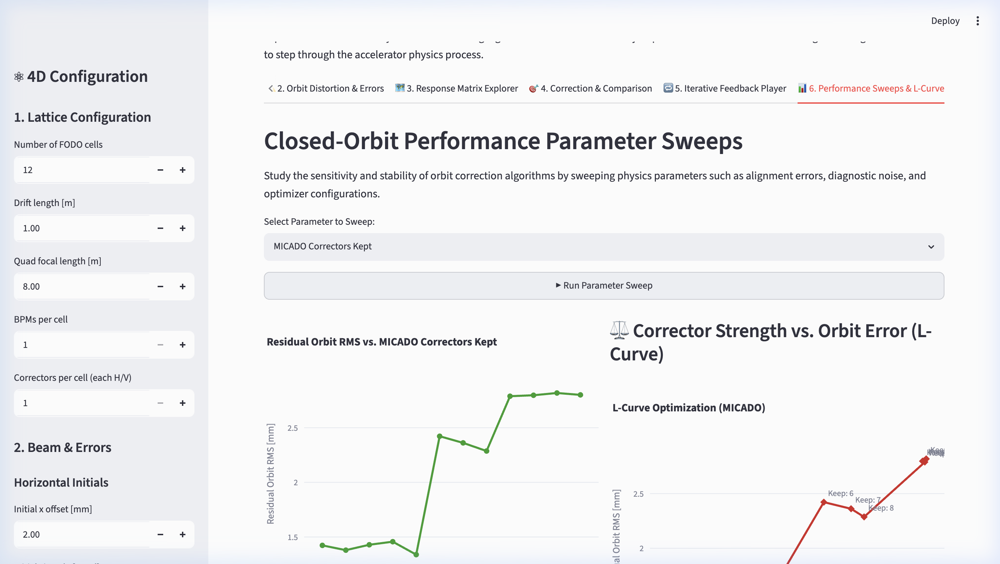
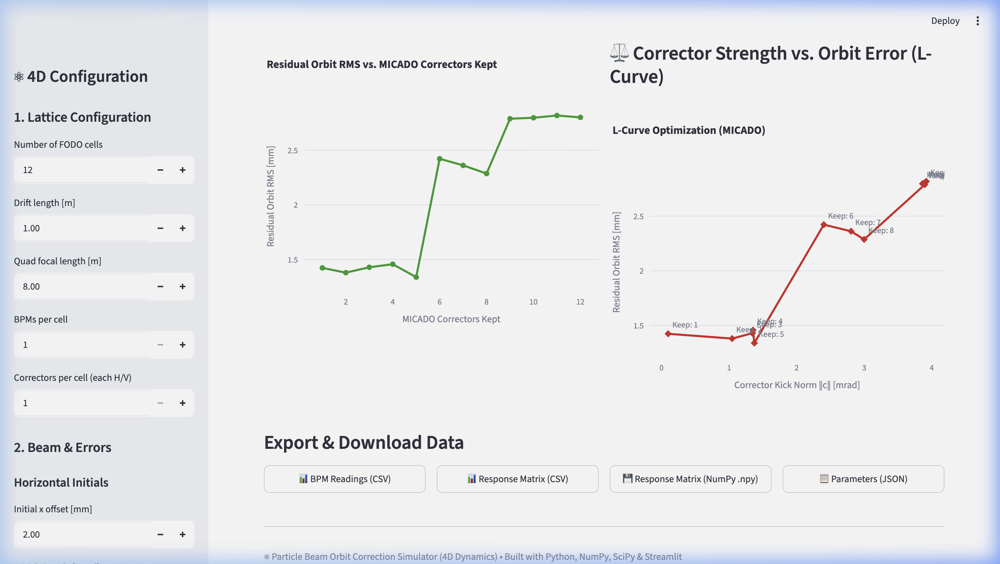

# Walkthrough - 4D closed-orbit dynamics & MICADO Orbit Correction

We have successfully upgraded the Particle Beam Orbit Correction Simulator to model **coupled transverse (4D) dynamics** across both the horizontal ($x$) and vertical ($y$) planes, added the **CERN-standard MICADO algorithm**, and overhauled the entire user interface into a structured **Interactive Scientific Walkthrough**.

We have also added advanced **physical errors** (quadrupole alignment offsets and rolls, BPM gain and offset calibration errors), **live RM control room calibration**, and a **Performance Sweeps & L-Curve Analysis Dashboard**.

## Implemented UI/UX & Process Visualizations

The dashboard has been reorganized into six sequential tabs that represent the actual physics process:

### 1. 🔬 Tab 1: Baseline Design & Lattice
- **Purpose:** Visualizes the baseline accelerator ring design, showing elements (Drifts, Quadrupoles, BPMs, and Correctors) and the ideal flat orbit ($x=0, y=0$ everywhere) before errors are applied.
- **Visuals:** Shows a 1D lattice layout schematic and a 2D FODO element layout.

### 2. ⚠️ Tab 2: Orbit Distortion & Errors
- **Purpose:** Introduces alignment errors at quadrupole magnets and initial beam offsets, showing the distorted orbit that diagnostics (BPMs) record before correction is executed.
- **Metrics:** Displays large premium metrics cards showing the Stacked RMS Orbit Error and peak Horizontal/Vertical orbit deviations.

### 3. 🗺️ Tab 3: Response Matrix Explorer & Corrector physics
- **Purpose:** Displays the response matrix heatmap (stacked $2N_{\text{BPM}} \times N_{\text{CORR}}$ dimensions) and assesses stability via the Condition Number ($\kappa$).
- **Corrector Explorer:** Exposes an interactive corrector selector. Selecting any HCOR or VCOR magnet and applying a test kick plots the beam's **response function** on the fly, demonstrating exactly how a single kick propagates downstream.
- **⚡ Live Calibration Scan:** Allows users to run a perturbation scan on the active machine with BPM noise. This calibration creates a noisy Response Matrix, simulating realistic control room operations.

### 4. 🎯 Tab 4: Correction & Comparison
- **Purpose:** Evaluates and overlays all four correction methods (Least-Squares, SVD, Iterative-SVD, and MICADO) on a single synchronized Plotly plot.
- **Sparsity:** Demonstrates how MICADO successfully flattens the orbit using only a small subset of active correctors.
- **Spectrum:** Renders the SVD singular values spectrum and the SVD cutoff threshold.

### 5. 🔁 Tab 5: Iterative Feedback Player
- **Purpose:** Allows the user to step through the iterative feedback correction loop.
- **Interaction:** Moving the slider updates both the beam trajectory plot and the corrector strength bar chart at that specific iteration step, letting the user watch the closed-orbit converge.

### 6. 📊 Tab 6: Performance Sweeps & L-Curve
- **Purpose:** Provides automated parameter sweep simulations to analyze correction sensitivity against BPM noise, offsets, quadrupole misalignments, or corrector counts.
- **L-Curve Optimization:** Displays the corrector kick norm versus the residual orbit distortion. The knee of the curve visually reveals the optimal trade-off between corrector strength usage and beam stability.

---

## Visual Demonstration

Below are the screenshots captured during testing of the interactive 6-tab dashboard.

### 🔬 Tab 1: Baseline Design & Lattice Layout

### ⚠️ Tab 2: Orbit Distortion & Errors

### 🗺️ Tab 3: Response Matrix & Live Calibration Scan

### 🎯 Tab 4: Solver Corrections & Comparison

### 🔁 Tab 5: Step-by-Step Iterative Feedback Player

### 📊 Tab 6: Parameter Sweeps & L-Curve Analysis

### 📽️ Interactive Sweep & Calibration Session Recording
The full recording demonstrating the live machine calibration and the parameter sweeps in action:

