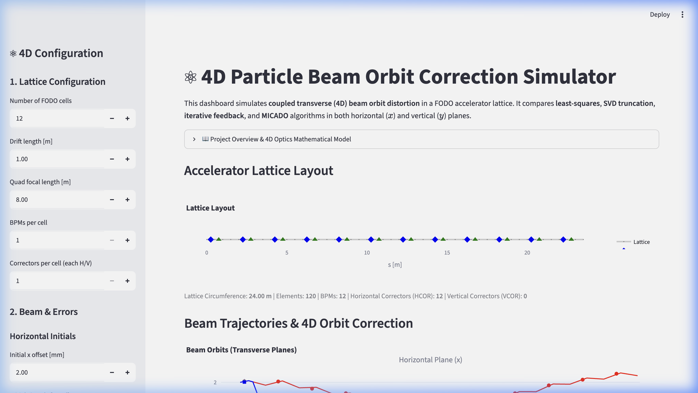
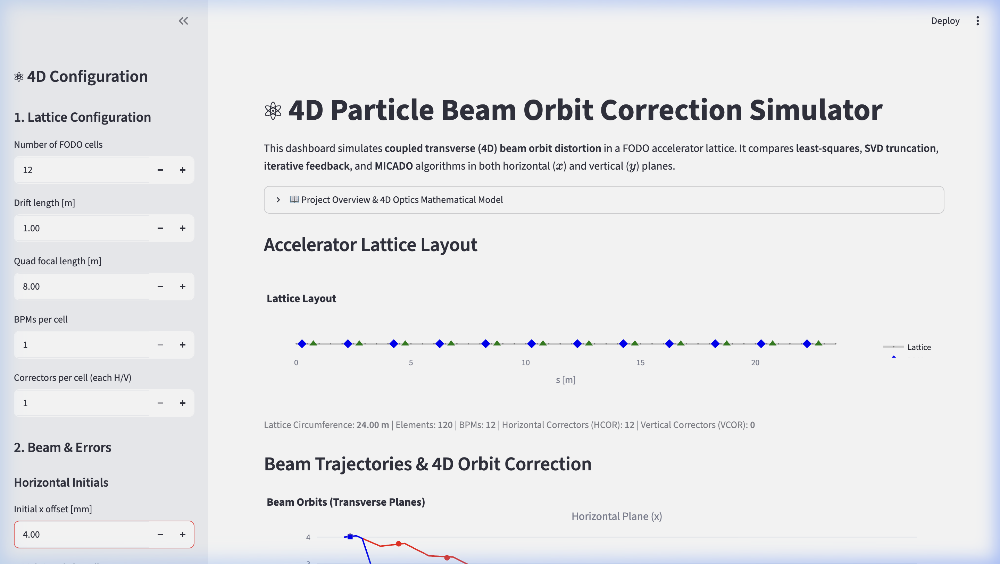

# Walkthrough - 4D Optics & MICADO Orbit Correction

We have successfully upgraded the Particle Beam Orbit Correction Simulator to model **coupled transverse (4D) dynamics** across both the horizontal ($x$) and vertical ($y$) planes. We have also added the **MICADO algorithm**, a standard orbit correction method used in operational facilities like CERN.

## Implemented Enhancements

### 1. 4D transverse optics & 4x4 transfer matrices
- **File Modified:** [src/beam.py](src/beam.py)
  - Upgraded `BeamState` to represent a 4D transverse vector: $X = [x, x', y, y']^T$.
- **File Modified:** [src/elements.py](src/elements.py)
  - Upgraded all element matrices (`Drift`, `Quadrupole`, `BPM`, `Corrector`, `ErrorKick`) from 2x2 to 4x4.
  - Implemented the focusing/defocusing transverse duality for the thin `Quadrupole` matrix: focusing in the horizontal plane implies defocusing in the vertical plane, and vice versa.
  - Added support for plane-specific correctors: horizontal (`plane="x"`) correctors kick $x'$, and vertical (`plane="y"`) correctors kick $y'$.
  - Upgraded `ErrorKick` to apply random kicks in both planes.
- **File Modified:** [src/errors.py](src/errors.py)
  - Upgraded `generate_lattice_error_kicks` to return a 2D array of shape `(2, len(lattice))` corresponding to horizontal and vertical random kicks.

### 2. Dual-Plane Corrector Magnet Lattice Positioning
- **File Modified:** [src/lattice.py](src/lattice.py)
  - Modified `build_fodo_lattice` to place horizontal correctors (`HCOR`) in focusing sections (near QFs) and vertical correctors (`VCOR`) in defocusing sections (near QDs). This mirrors optimal design practices in real accelerators.

### 3. Stacked 4D tracking & Stacked Response Matrix
- **File Modified:** [src/tracking.py](src/tracking.py)
  - Upgraded `Trajectory` to store $x$, $x'$, $y$, and $y'$ positions along the ring circumference.
  - Upgraded `track_beam` to propagate the 4D state vector and simulate BPM noise on both horizontal and vertical monitors.
  - Upgraded `compute_response_matrix` to perturb HCOR and VCOR magnets one-by-one and stack the horizontal and vertical BPM readings: $[x_1, \dots, x_N, y_1, \dots, y_N]^T$. The computed response matrix has shape $(2 N_{\text{BPM}}) \times N_{\text{CORR}}$.

### 4. The MICADO Orbit Correction Algorithm
- **File Modified:** [src/correction.py](src/correction.py)
  - Implemented the `micado_correction` algorithm. It selects the single most effective corrector at each step that minimizes the remaining sum-of-squares, keeping the correction profile sparse.
  - Updated `iterative_correction` to handle 4D stacked vectors.

### 5. Multi-Plane Orbit Plotting & Interactive Subplots
- **File Modified:** [src/plotly_viz.py](src/plotly_viz.py)
  - Re-designed `orbit_figure` to render a stacked 2-row layout using Plotly's `make_subplots` (Row 1: Horizontal orbit $x$ vs. $s$; Row 2: Vertical orbit $y$ vs. $s$).
  - Synchronized legends across the subplots using `legendgroup` so that toggling a method hides/shows it in both planes.
  - Plotted horizontal correctors as vertical indicators in the horizontal plane, and vertical correctors in the vertical plane.

### 6. Interactive 4D Streamlit Interface
- **File Modified:** [app.py](app.py)
  - Added initial vertical coordinates controls ($y$, $y'$) and a slider for the number of correctors to retain in the MICADO algorithm.
  - Runs all 4 correction methods (Least-Squares, SVD, Iterative-SVD, and MICADO) concurrently and compares them side-by-side.
  - Exports combined multi-plane CSVs and 2D response matrices.

---

## Verification & Testing

### Unit Tests
Upgraded the unit tests in:
- `tests/test_elements.py`: Verify 4x4 matrix dimensions and 4D propagation.
- `tests/test_tracking.py`: Verify 4D tracking, noise, and stacked response matrices.
- `tests/test_correction.py`: Added direct tests for `micado_correction` to ensure sparsity constraints and orbit error minimization.

All 34 unit tests pass successfully:
```bash
$ .venv/bin/pytest
============================== 34 passed in 0.23s ==============================
```

---

## Visual Demonstration

Below are the screenshots captured during testing of the reactive 4D accelerator orbit correction dashboard.

### Dashboard Interface Screenshots

- **Initial State of 4D Simulator:**


- **Updated State (reactive parameter shift):**


### Interactive UI Recording

